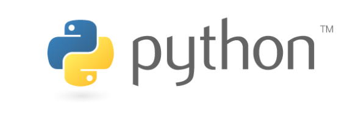

# Python Projects (DataCamp)  
This repo contains python projects I completed on DataCamp ([datacamp.com](datacamp.com)) 
  
using **Python**
 

These are **Guided** projects, with detailed instructions and tests for checking results.

<ins>Projects listed by category</ins>:   
   
Applied Finance   
- "Predicting Credit Card Approvals"   
   
Case Studies   
- "Introduction to DataCamp Projects"   
- "Dr. Semmelweis and the Discovery of Handwashing"   
- "Investigating Netflix Movies and Guest Stars in The Office"   
   
Data Manipulation   
- "A Visual History of Nobel Prize Winners"   
- "The Android App Market on Google Play"   
- "The GitHub History of the Scala Language"   
- "Predicting Credit Card Approvals"   
- "The Hottest Topics in Machine Learning"   
- "Introduction to DataCamp Projects"   
- "Dr. Semmelweis and the Discovery of Handwashing"   
- "Investigating Netflix Movies and Guest Stars in The Office"   
   
Data Visualization   
- "A Visual History of Nobel Prize Winners"   
- "The Android App Market on Google Play"   
- "The GitHub History of the Scala Language"   
- "The Hottest Topics in Machine Learning"   
- "Introduction to DataCamp Projects"   
- "Dr. Semmelweis and the Discovery of Handwashing"   
- "Investigating Netflix Movies and Guest Stars in The Office"   
   
Importing & Cleaning Data   
- "A Visual History of Nobel Prize Winners"   
- "The Android App Market on Google Play"   
- "The GitHub History of the Scala Language"   
- "Predicting Credit Card Approvals"   
- "The Hottest Topics in Machine Learning"   
- "Introduction to DataCamp Projects"   
- "Dr. Semmelweis and the Discovery of Handwashing"   
   
Machine Learning   
- "Predicting Credit Card Approvals"   
- "The Hottest Topics in Machine Learning"   
   
Probability & Statistics   
- "The Android App Market on Google Play"   
- "The Hottest Topics in Machine Learning"   
- "Dr. Semmelweis and the Discovery of Handwashing"   
   
Programming   
- "Writing Functions for Product Analysis"   
- "Investigating Netflix Movies and Guest Stars in The Office"   

Projects are provided in *.ipynb* (Jupyter notebook), *.html*, & *.pdf* formats.
